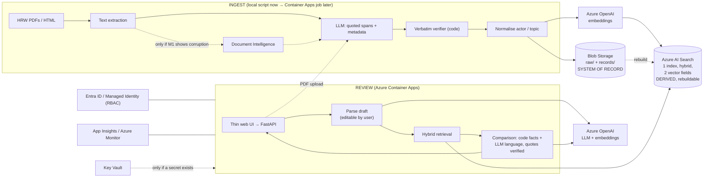

# Architecture v1 (hypothesis, to be validated milestone by milestone)

Dashed = conditional on evidence. Key Vault is dashed because with Managed Identity + RBAC the POC holds no secrets.

```mermaid
flowchart LR
  subgraph Ingest["INGEST (local script now → Container Apps job later)"]
    SRC["HRW PDFs / HTML"] --> TX["Text extraction"]
    TX -.->|only if M1 shows corruption| DI["Document Intelligence"]
    TX --> EXT["LLM: quoted spans + metadata"]
    DI -.-> EXT
    EXT --> VER["Verbatim verifier (code)"]
    VER --> NORM["Normalise actor / topic"]
  end

  NORM --> BLOB[("Blob Storage<br/>raw/ + records/<br/>SYSTEM OF RECORD")]
  NORM --> EMB["Azure OpenAI<br/>embeddings"]
  EMB --> IDX[("Azure AI Search<br/>1 index, hybrid,<br/>2 vector fields<br/>DERIVED, rebuildable")]
  BLOB -. rebuild .-> IDX

  subgraph Review["REVIEW (Azure Container Apps)"]
    UI["Thin web UI → FastAPI"] --> PARSE["Parse draft<br/>(editable by user)"]
    PARSE --> RET["Hybrid retrieval"]
    RET --> CMP["Comparison: code facts +<br/>LLM language, quotes verified"]
    CMP --> UI
  end

  RET --> IDX
  PARSE --> AOAI["Azure OpenAI<br/>LLM + embeddings"]
  CMP --> AOAI
  UI -. PDF upload .-> EXT

  MI["Entra ID / Managed Identity (RBAC)"] --- Review
  MON["App Insights / Azure Monitor"] --- Review
  KV["Key Vault"] -.->|only if a secret exists| Review
```
